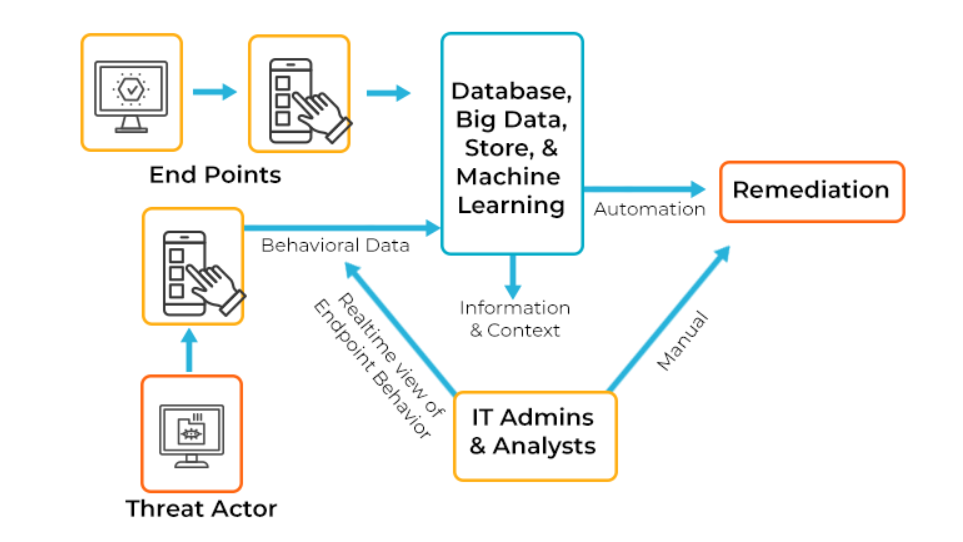
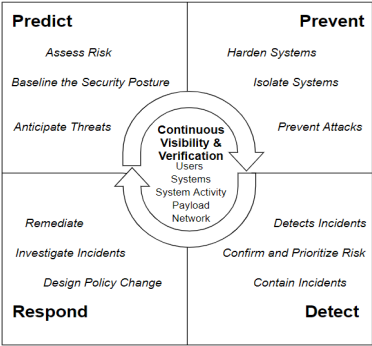

# EDR Nedir?

**Endpoint Detection and Response (EDR)**, siber güvenlik alanında kullanılan bir sistemdir ve uç nokta (son kullanıcı) cihazlarını sürekli olarak izler. Bu sistem, potansiyel tehditleri algılar, gerçek zamanlı olarak saldırıları belirler ve ilgili kişileri bilgilendirir. Ardından, otomatik iş akışları veya insan müdahalesiyle uygun önlemler alınarak saldırılarla etkin bir şekilde başa çıkılır [2].

## EDR Ne Değildir?

### EDR ve Antivirüs — Aralarındaki Fark Nedir?

EDR sistemlerini geleneksel antivirüs çözümleriyle karşılaştırdığınızda, antivirüs araçlarının daha basit olduğunu ve EDR'ın temel bir bileşeni olduğunu görürsünüz. Antivirüs araçları genellikle tarama, teşhis ve kötü amaçlı yazılımları kaldırma gibi temel görevleri yerine getirir ve imza tabanlı tehdit tespit yöntemlerine dayanır. Ancak, yalnızca veritabanlarındaki imzalara dayalı tehditleri algılayabilirler. Bir tehdidin imzası yoksa, algılanmazlar.

Öte yandan, EDR çözümleri daha geniş bir kapsama sahiptir ve saldırı engelleme, yama uygulama, exploit engelleme, güvenlik duvarı, beyaz listeleme/kara listeleme ve yeni nesil antivirüs yetenekleri gibi birden fazla güvenlik katmanını içerir. EDR, gelişmiş tehditlerle başa çıkmak ve iş güvenliği gereksinimlerini karşılamak için daha donanımlıdır.

### EDR ve EPP — Aralarındaki Fark Nedir?

EPP, Endpoint Protection Platform’nun kısaltmasıdır ve ağınızın çevresine yaklaşan tehditlere karşı koruma sağlamayı amaçlar. Bilinen kötü amaçlı yazılımları ve fidye yazılımı gibi gelişmiş tehditleri kapsar. Diğer yandan, EDR, EPP'nin birincil savunmalarını atlayan ve ortamınıza sızmış olan APT gibi gelişmiş tehditleri hedefler.

EPP, veri ve dosya şifreleme, antivirüs, imza eşleştirme, kum kutusu ve son kullanıcı güvenlik duvarları gibi özelliklerle tehditleri pasif olarak önlerken, EDR, EPP savunmaları tarafından kaçırılan tehditlere anlık tepki sağlar ve ihlallerin soruşturulmasına yardımcı olur.

## EDR Neden Gereklidir?

Günümüzde, siber saldırılar giderek karmaşık ve yaygın hale geliyor, bu da insanların veri güvenliğini tehdit ediyor. 2022'de CyberEdge grubunun raporuna göre, fidye yazılımları %71 gibi yüksek bir oranda kurumları hedef aldı ve zarar verdi. Bu saldırıların bazıları basit ve fırsatçı olabilir; örneğin, bir fidye yazılımını içeren bir e-posta ekini göndererek son kullanıcıları hedef alabilirler. Ancak, daha sofistike saldırılarda, tehdit aktörleri bilinen zafiyetleri veya saldırı yöntemlerini kullanarak gelişmiş taktikler izleyebilirler. Hatta, kaynakları yeterliyse, bilinmeyen uygulama veya sistem zafiyetlerinden yararlanarak "zero-day" saldırıları bile gerçekleştirebilirler.

Saldırılar çeşitli önlemlerle engellenebilir. Ama tespit etmek ve yanıt vermek gereklidir. İşte EDR tam bu noktada ortaya çıkıyor. Yapılan araştırmalar, EDR kullanan güvenlik kuruluşlarının, ciddi güvenlik olaylarında %82,5'lik bir azalma ile, EDR kullanmayanlara göre %50 daha düşük ciddi güvenlik olaylarına sahip olduğunu ortaya koymaktadır. En başarılı güvenlik kuruluşlarının ise EDR ve EPP kombinasyonunu kullanma olasılığının %165 daha fazla olduğu belirlenmiştir. Bu nedenle, EDR ve EPP gibi entegre güvenlik çözümleri, kuruluşların siber saldırılara karşı daha etkili bir savunma sağlayabilir ve olayları daha hızlı tespit edip yanıt verebilirler [3].

## EDR Nasıl Çalışır?

Günümüzde, işletmelerin karşılaştığı en büyük güvenlik tehditlerinden biri, gelişmiş kalıcı tehditlerdir (APT'ler). Bu tür saldırılar, geleneksel güvenlik önlemlerini aşarak büyük zararlara neden olabilir. Bu nedenle, işletmeler, bilgisayar ağlarının savunmasını güçlendirmek için yeni ve etkili güvenlik çözümleri arayışındadır. Bu bağlamda, EDR (Endpoint Detection and Response) çözümleri ön plana çıkmaktadır. EDR, bilgisayar ağlarında tespit edilmeden geçen saldırıları önlemek için tasarlanmıştır. Resim 1’de bu konu basit bir aktarımla gösterilmiştir [2]. Dosyasız kötü amaçlı yazılımlar, kötü amaçlı komut dosyaları gibi popüler saldırı taktiklerine karşı koruma sağlar. Ancak, EDR'nin rolü sadece savunma değil, aynı zamanda saldırıları tespit etmek ve etkisiz hale getirmek için de önemlidir. Çözüm, son kullanıcı devam eden tüm faaliyetleri izler ve gerçek zamanlı tehdit istihbaratı sunar. Bu, olay verilerini arama, şüpheli etkinlikleri algılama ve kontrol altına alma, tehditleri avlama gibi işlevleri içerir.

EDR’ın bu özellikli çalışma yapısı aslında NIST’ın hayat döngüsünü kapsayacak şekilde “Resim 2” olduğu gibi gösterilebilir [1].
 

Bu başlıklar “Öngörü (Predict), Önleme (Prevent), Tespit (Detect), Cevap (Response)” olarak sınıflandırılabilir.

----

### 1. Predict (Öngörü):

Predict (Öngörü) aşamasında, Endpoint Detection and Response (EDR) sistemi, son kullanıcılara gerçek zamanlı izleme yapar. Kullanıcı girişleri veya çalıştırdığı uygulamaların verileri gibi çeşitli kaynaklardan elde edilir. Toplanan veriler, gizlilik önlemleriyle anonimleştirilir ve daha sonra EDR’a gönderilir [4].

### 2. Prevent (Önlemek):

Prevent (Önlemek) aşamasında, Endpoint Detection and Response (EDR) sistemi, tehditlerin sistemlere sızmasını engellemek için önleyici önlemler alır. Bu aşamada, güvenlik yazılımları (antivirüs, anti-malware), güvenlik duvarları ve ağ erişim kontrolleri gibi çeşitli güvenlik araçları kullanılır. Ayrıca, internet ortamından elde edilen diğer siber saldırı verileriyle geliştirilen yapay zeka da kullanılarak, saldırıları tanımlama ve önleme yetenekleri artırılır. Sistemlerin düzenli olarak güncellenmesi ve güvenlik açıklarının kapatılması da önemlidir. Kötü amaçlı yazılım taraması ve zararlı web sitelerine karşı filtreleme gibi önlemler de alınarak, saldırı vektörleri azaltılmaya çalışılır. Bu şekilde, kuruluşlar potansiyel tehditlere karşı güçlü bir savunma mekanizması oluşturarak sistemlerini koruyabilirler [2].

### 3. Detect (Tespit):

Detect (Tespit) aşamasında, Endpoint Detection and Response (EDR) sistemi çeşitli yöntemler kullanarak tehditleri tespit eder. İlk olarak, network trafiği imzaları, bilinen kötü amaçlı yazılım imzaları veritabanıyla karşılaştırılarak eşleşme aranır. Ardından, davranışsal analiz yapılır; bu analizde, son kullanıcının kabul edilen davranış eşiği belirlenir ve bu eşiğin dışına çıkan olağandışı davranışlar tespit edilir, hatta tüm trafiğin imzaları geçerli olsa bile. Bunun yanı sıra, potansiyel kötü amaçlı dosyalar bir havuza yerleştirilir ve sandbox analizi yapılır; böylece dosyaların davranışları gözlemlenir ve son kullanıcıya zarar verilmeden incelenir. Son olarak, whitelist/blacklist eşleştirme kullanılarak, son kullanıcının etkinlikleri önceden belirlenmiş bir beyaz liste ve kara listeyle karşılaştırılır ve ağ trafiğine izin verilip verilmeyeceği belirlenir. Bu yöntemlerin bir arada kullanılması, EDR sisteminin tehditleri daha etkili bir şekilde tespit etmesini sağlar [2].

### 4. Response (Müdahale):

Response (Müdahale) aşamasında, Endpoint Detection and Response (EDR) sistemi, tespit edilen tehditlere hızlı ve etkili bir şekilde yanıt verir. Bu aşamada, yapay zeka ve otomasyon teknikleri kullanılarak tehditlere otomatik olarak müdahale edilir veya güvenlik analistlerine öneriler sunulur. Örneğin, kötü amaçlı yazılımlar tespit edildiğinde, yapay zeka tabanlı algoritmalar otomatik olarak bu yazılımları izole edebilir veya kaldırabilir. Ayrıca, saldırının yayılmasını engellemek için etkilenen sistemler yapay zeka tarafından yönetilen otomatik izolasyon işlemlerine tabi tutulabilir. Müdahale edilen tehditlerle ilgili ayrıntılı bilgi ve izleme verileri sağlanır, böylece güvenlik analistleri olayı inceleyebilir ve gerekli adımları atabilir. Bu entegre yaklaşım, EDR sisteminin saldırılara hızlı bir şekilde yanıt vererek zararın minimize edilmesini sağlar ve kuruluşların güvenlik seviyelerini artırır [5].

## Sonuç

Endpoint Detection and Response (EDR) sisteminin, günümüzdeki siber tehditlerle mücadelede kritik bir rol oynadığını vurguladık. EDR, kuruluşların son kullanıcı cihazlarını sürekli olarak izleyerek, potansiyel tehditleri tespit etme ve yanıt verme kabiliyetlerini artırır. Ayrıca, geleneksel güvenlik çözümlerinin ötesine geçerek, yapay zeka ve davranış analizi gibi ileri teknolojileri kullanarak daha etkili bir koruma sağlar. Bu nedenle, kuruluşlar siber güvenlik stratejilerine EDR gibi entegre güvenlik çözümlerini dahil etmelidir. Bu sayede, veri güvenliğini sağlama ve potansiyel tehditlere karşı daha hızlı ve etkili bir şekilde yanıt verme yetenekleri artar. Sonuç olarak, EDR, modern bir güvenlik altyapısının vazgeçilmez bir parçasıdır ve kuruluşların siber tehditlere karşı daha güvenli bir şekilde hareket etmelerini sağlar.

## Kaynakça

[1] Arfeen, A., Ahmed, S., Khan, M. A., & Jafri, S. F. (2022, 23 Nisan). Endpoint Detection & Response: A Malware Identification Solution. ieeexplore: [https://ieeexplore.ieee.org/document/9703010](https://ieeexplore.ieee.org/document/9703010)

[2] BasuMallick, C. (tarih yok). What is EDR. spiceworks: [https://www.spiceworks.com/it-security/endpoint-security/articles/what-is-edr/](https://www.spiceworks.com/it-security/endpoint-security/articles/what-is-edr/)

[3] Comcast. (tarih yok). how endpoint detection and response edr can help reduce serious incidents. comcast.com: [https://business.comcast.com/community/browse-all/details/how-endpoint-detection-and-response-edr-can-help-reduce-serious-incidents](https://business.comcast.com/community/browse-all/details/how-endpoint-detection-and-response-edr-can-help-reduce-serious-incidents)

[4] Kaspersky. (tarih yok). endpoint detection and response. kaspersky: [https://www.kaspersky.com/resource-center/preemptive-safety/endpoint-detection-and-response](https://www.kaspersky.com/resource-center/preemptive-safety/endpoint-detection-and-response)

[5] Xcitium. (tarih yok). How EDR works. xcitium: [https://www.xcitium.com/how-edr-works/](https://www.xcitium.com/how-edr-works/)
